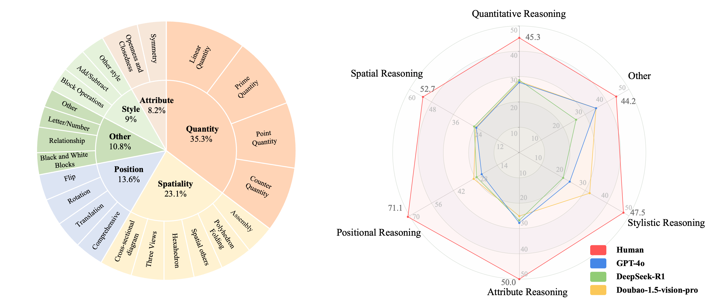

# VisuLogic: A Benchmark for Evaluating Visual Reasoning in Multi-modal Large Language Models

**A Chanllenging Visual-centric Benchmark for Evaluating Multimodal Reasoning in MLLMs!**

This repo is a fork of [**lmm-r1**](https://github.com/TideDra/lmm-r1)


Paper, training datasetsand model checkpoints are coming!

For more details, please refer to the project page with dataset exploration and visualization tools: [https://visulogic-benchmark.github.io/VisuLogic/](https://visulogic-benchmark.github.io/VisuLogic/).

# VisuLogic Benchmark

[**🌐 Homepage**](https://visulogic-benchmark.github.io/VisuLogic) | [**🏆 Leaderboard**(coming soon)](https://visulogic-benchmark.github.io/VisuLogic/) |


## 🔔News

- **🔥[2025-04-08] Release the benchmark and the codes! 🚀**
## To-do
- [x] Release the benchmark dataset and eval codes
- [ ] Release training codes
- [ ] Release the paper
- [ ] Release the training dataset
- [ ] Release model ckpts




## 🌟 Key Features

- 🚀 **Visuo-Logical Challenge**  
  The first benchmark to integrate **visual perception** with **logical reasoning**, enabling authentic multimodal evaluation.
  
- 🛠️ **Rigorous Design**  
  Includes **1,000 meticulously curated questions**, spanning **6 domains** and **23 subcategories**, for comprehensive performance evaluation.
  
- 📝 **Anti-Linguistic Shortcut**  
  Designed to avoid linguistic biases, ensuring tasks rely on **genuine visual reasoning** rather than shortcuts.

- 📊 **Human-Aligned Evaluation**  
  - **Human Accuracy**: >50.0%  
  - **State-of-the-Art (SOTA) MLLMs Accuracy**: <30%

## Benchmark Data

For more detailed information, please refer to our Hugging Face datasets:

- [**🤗 VisuLogic Dataset**](https://huggingface.co/datasets/VisuLogic/VisuLogic)

## Evaluation
Please refer to [VisuLogic-Eval](https://github.com/VisuLogic-Benchmark/VisuLogic-Eval.git) for evaluation codes.

## Training
### 📦Installation
```bash
git clone https://github.com/VisuLogic-Benchmark/VisuLogic-Train.git
cd VisuLogic-Train
pip install -e .[vllm]
pip install flash_attn --no-build-isolation
```
### 📊Prepare dataset
#### Dataset Access
We publicly release the ​​VisuLogic Training Dataset​​, a curated collection derived from the same underlying benchmark sources used in our experiments. Please refer to [**🤗 VisuLogic Dataset**](https://huggingface.co/datasets/VisuLogic/VisuLogic) and download our datasets.
#### Preparing Your Custom Dataset
To ensure compatibility with our codebase, multimodal prompt datasets must be formatted in OpenAI-compatible message structures. We recommend organizing your data as a JSON Lines (JSONL) file with the .jsonl extension.
```json
[
  {
    "message":"[
      {
        \"role\": \"user\",
        \"content\": [
            { \
                \"type\": \"image\",
                \"image\": \"file:///path/to/your/image.jpg\",
            }, \
            {\"type\": \"text\", \"text\": \"<image>\\nHow many cats in the image?\"},
        ],
      }
    ]",
    "answer": "$3$"
  },
]
```
**Attention**
- ​**​Message Format​**​:  
  Ensure the `messages` field is a ​**​stringified​**​ list (e.g., `"[{\"role\": \"user\", \"content\": ...}]"`).

- ​**​Image-Tag Alignment​**​:  
  When training InternVL models, the number of `<image>\n` tags in the input text ​**​must exactly match​**​ the number of images provided in the message.

- ​**​Parameter Usage​**​:  
  - Use `--input_key {key_name}` to specify the JSON key containing the input data.  
  - For PPO training, provide data via `--prompt_data {name/path}`; for general training, use `--dataset {name/path}`.

- ​**​Multimodal Handling​**​:  
  - ​**​Do not​**​ enable `--apply_chat_template` for multimodal prompts—message parsing and image token insertion are handled internally by the framework.

### Start training

Our codes support QwenVL and InternVL series models. 

## Contact
- Jiahao Wang: wjhwdscience@stu.xjtu.edu.cn
- Weiye Xu: ustcxwy0271@mail.ustc.edu.cn

## Citation

**BibTeX:**
```bibtex
@misc{visulogic,
    title        = {VisuLogic: A Benchmark for Evaluating Visual Reasoning in Multi-modal Large Language Models},
    author       = {VisuLogic-Benchmark},
    howpublished = {\url{https://github.com/VisuLogic-Benchmark/VisuLogic-Eval}},
    year         = {2025},
    note         = {Accessed: 2025-04-08}
}
```
