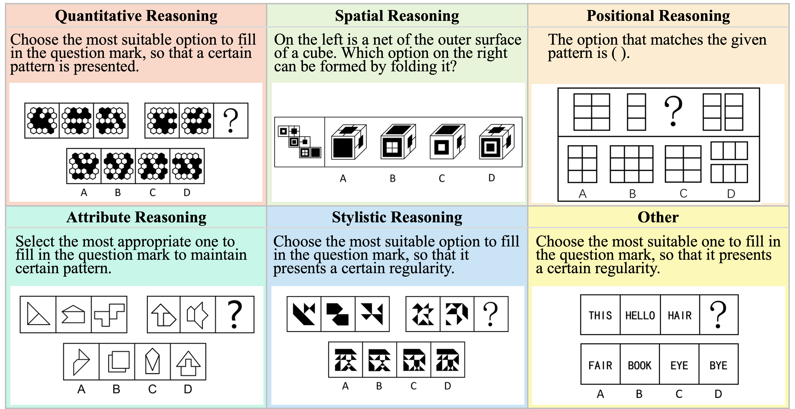

# VisuLogic: A Benchmark for Evaluating Visual Reasoning in Multi-modal Large Language Models

**A Chanllenging Visual-centric Benchmark for Evaluating Multimodal Reasoning in MLLMs!**

This the RL training codes repo of [VisuLogic](https://visulogic-benchmark.github.io/VisuLogic). This repo is a fork of [**lmm-r1**](https://github.com/TideDra/lmm-r1).

For more details, please refer to the project page with dataset exploration and visualization tools: [https://visulogic-benchmark.github.io/VisuLogic/](https://visulogic-benchmark.github.io/VisuLogic/).

# VisuLogic Resouces

[**🌐 Homepage**](https://visulogic-benchmark.github.io/VisuLogic) | [**🏆 Leaderboard**](https://visulogic-benchmark.github.io/VisuLogic/) | [**📖 Paper**](http://arxiv.org/abs/2504.15279) | [**🤗 Benchmark**](https://huggingface.co/datasets/VisuLogic/VisuLogic) | [**💻 Eval Code**](https://huggingface.co/datasets/VisuLogic/VisuLogic) | [**🤗 Train Data**](https://huggingface.co/datasets/VisuLogic/VisuLogic) | [**💻 Train Code**](https://github.com/VisuLogic-Benchmark/VisuLogic-Train)


## 🔔News
- **🔥[2025-04-22] Release the paper, training data and training code! 🚀**
- **🔥[2025-04-08] Release the benchmark and the codes! 🚀**
## To-do
- [x] Release the benchmark dataset and eval codes
- [x] Release training codes
- [x] Release the paper
- [x] Release the training dataset
- [x] Release model ckpts

## 📖 Introduction
VisuLogic is a newly designed benchmark aimed at evaluating the visual reasoning capabilities of Multi-modal Large Language Models (MLLMs), independent of textual reasoning processes. It features carefully constructed visual reasoning tasks spanning multiple categories, divided into six types based on required reasoning skills (e.g., Quantitative Reasoning, which involves understanding and deducing changes in the quantity of elements in images). Unlike existing benchmarks, VisuLogic is a challenging visual reasoning benchmark that is inherently difficult to articulate using language, providing a more rigorous evaluation of the visual reasoning capabilities of MLLMs. Most models score below 30\% accuracy—only slightly above the 25\% random baseline and far below the 51.4\% achieved by humans—revealing significant gaps in visual reasoning.


## 🌟 Key Features

- 🚀 **Visuo-Logical Challenge**  
  The first benchmark to integrate **visual perception** with **logical reasoning**, enabling authentic multimodal evaluation. Most models score below **30%** accuracy—only slightly above the 25% random baseline and far below the 51.4% achieved by humans—revealing significant gaps in visual reasoning.
  
- 🛠️ **Rigorous Design**  
  Includes **1,000 meticulously curated questions**, spanning **6 domains** and **24 subcategories**, for comprehensive performance evaluation.
  
- 📝 **Anti-Linguistic Shortcut**  
  Designed to avoid linguistic reasoning, ensuring tasks rely on **genuine visual reasoning** rather than shortcuts.

- 💡 **RL Exploration**  
  We identify the  RL technique as a promising direction for improving the visual reasoning capabilities of MLLMs. Through RL method, models reach **SOTA** in VisuLogic!

- ✅ **Fully Open-source**  
  We **open-source** all the evaluation code, training scripts, and datasets associated with this work to promote further research and innovation.

## 🖼️  Examples of VisuLogic


## Training Data

For more detailed information, please refer to our Hugging Face datasets:

- [**🤗 Train Data**](https://huggingface.co/datasets/VisuLogic/VisuLogic-Train) 

## Evaluation
Please refer to [VisuLogic-Eval](https://github.com/VisuLogic-Benchmark/VisuLogic-Eval.git) for evaluation codes.

## Training
### 📦Installation
```bash
git clone https://github.com/VisuLogic-Benchmark/VisuLogic-Train.git
cd VisuLogic-Train
pip install -e .[vllm]
pip install flash_attn --no-build-isolation
```
### 📊Prepare dataset
#### Dataset Access
We publicly release the ​​VisuLogic Training Dataset​​, a curated collection derived from the same underlying benchmark sources used in our experiments. Please refer to [**🤗 VisuLogic Dataset**](https://huggingface.co/datasets/VisuLogic/VisuLogic) and download our datasets.
#### Preparing Your Custom Dataset
To ensure compatibility with our codebase, multimodal prompt datasets must be formatted in OpenAI-compatible message structures. We recommend organizing your data as a JSON Lines (JSONL) file with the .jsonl extension.
```json
[
  {
    "message":"[
      {
        \"role\": \"user\",
        \"content\": [
            { \
                \"type\": \"image\",
                \"image\": \"file:///path/to/your/image.jpg\",
            }, \
            {\"type\": \"text\", \"text\": \"<image>\\nHow many cats in the image?\"},
        ],
      }
    ]",
    "answer": "$3$"
  },
]
```
**Attention**
- ​**​Message Format​**​:  
  Ensure the `messages` field is a ​**​stringified​**​ list (e.g., `"[{\"role\": \"user\", \"content\": ...}]"`).

- ​**​Image-Tag Alignment​**​:  
  When training InternVL models, the number of `<image>\n` tags in the input text ​**​must exactly match​**​ the number of images provided in the message.

- ​**​Parameter Usage​**​:  
  - Use `--input_key {key_name}` to specify the JSON key containing the input data.  
  - For PPO training, provide data via `--prompt_data {name/path}`; for general training, use `--dataset {name/path}`.

- ​**​Multimodal Handling​**​:  
  - ​**​Do not​**​ enable `--apply_chat_template` for multimodal prompts—message parsing and image token insertion are handled internally by the framework.

### ⚙️Start training

Our codebase supports the QwenVL​​ and ​​InternVL​​ series of MLLMs and we provide Slurm job script examples.
- Train on Qwen2.5-VL-7B-Instruct
```bash
# Hardware Requirements: 8×80GB GPUs (e.g. A100/A800)
bash examples/visulogic/srun_qwen2_5vl7b.sh
```

- Train on InternVL2_5-38B
```bash
# Hardware Requirements: 48×80GB GPUs (e.g. A100/A800)
bash examples/visulogic/srun_qwen2_5vl7b.sh
```

## Contact
- Weiye Xu: ustcxwy0271@mail.ustc.edu.cn
- Jiahao Wang: wjhwdscience@stu.xjtu.edu.cn


## Citation

**BibTeX:**
```bibtex
@article{xu2025visulogic,
  title={VisuLogic: A Benchmark for Evaluating Visual Reasoning in Multi-modal Large Language Models},
  author={Xu, Weiye and Wang, Jiahao and Wang, Weiyun and Chen, Zhe and Zhou, Wengang and Yang, Aijun and Lu, Lewei and Li, Houqiang and Wang, Xiaohua and Zhu, Xizhou and Wang, Wenhai and Dai, Jifeng and Zhu, Jinguo},
  journal={arXiv preprint arXiv:2504.15279},
  year={2025},
  url={https://arxiv.org/abs/2504.15279}
}
```
🎉 Thank you for your interest in VisuLogic! We hope this benchmark helps drive advancements in multimodal visual reasoning! 🚀
